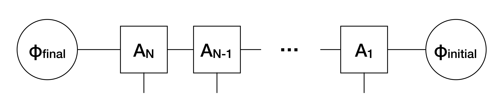
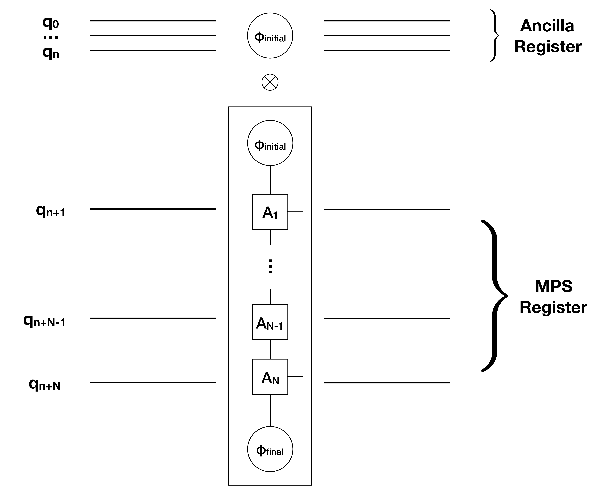

# Preparing Matrix Product States (MPS) on a Quantum Computer

Matrix Product States are a class of wavefunctions that have found widespread use in Quantum Physics and, to some extent, machine learning. This notebook is not meant to even touch on the vast literature on MPS (see https://arxiv.org/abs/1603.03039 for a marvelous review). Here, we merely show how to use the prepare_mps package in this repository.

Given a set of $d \times \chi \times \chi$ (physical, left, right) matrices $A_1, \dots A_N$ and a set of boundary vectors $\phi_\text{initial}$ and $\phi_\text{final}$ of size $\chi$, our definition is as follows



The function prepare_mps.MPS_to_circuit(A, phi_initial, phi_final) constructs a circuit that prepares the following:



i.e., the first $n$ qubits are in a product state with the rest of the system. Those first $n$ qubits are ancilla qubits and they are guaranteed to be in the (normalized version of) $\phi_\text{initial}$. Here, $n$ is the logarithm of the bond dimension (rounded up).

\begin{equation*}
n = \log(\chi)))
\end{equation*}

Currently the bond dimension of all matrices has to be the same and a power of 2, but this is fixed easily by appending zeros to any given matrix. Let's look at some code:

## Create a random MPS and verify that the output of the circuit is correct


```python
import prepare_MPS as mps
import numpy as np
from qiskit import BasicAer, execute

#Create Random MPS with size 4, bond dimension 4 and physical dimension 2 (qubits)
N=4
d=2
chi=4
phi_final=np.random.rand(chi)
phi_initial=np.random.rand(chi)
A=mps.create_random_tensors(N,chi,d)

#Create the circuit. The 'reg' register corresponds to the 'MPS' register in the picture above
qc, reg = mps.MPS_to_circuit(A, phi_initial, phi_final)

#Run the circuit on the statevector simulator
backend = BasicAer.get_backend("statevector_simulator")
job = execute(qc, backend)
result = job.result()
psi_out=result.get_statevector()

#Contract out the ancilla with the known state
psi_out=psi_out.reshape(d**N,chi)
exp=psi_out.dot(phi_final)

#Prepare the MPS classically
thr,_=mps.create_statevector(A,phi_initial,phi_final,qiskit_ordering=True)

#Compare the resulting vectors (fixing phase and normalization)
exp=mps.normalize(mps.extract_phase(exp))
thr=mps.normalize(mps.extract_phase(thr))

print("The MPS is \n {}".format(thr))
print("The statevector produced by the circuit is \n {}".format(exp))


```

    /Users/henrikdreyer/qiskit-terra-master/qiskit/pulse/channels/pulse_channels.py:25: DeprecationWarning: Channels have been migrated. Please use `from qiskit.pulse.channels import X` rather than `from qiskit.pulse.channels.pulse_channels import X`.
      DeprecationWarning)


    The MPS is 
     [0.27853458+3.61541549e-17j 0.27101406+6.83614144e-02j
     0.26411109-2.69512568e-02j 0.25527158+5.46036540e-02j
     0.27460159+2.95221901e-02j 0.25654656+9.68158273e-02j
     0.25020076-7.92468697e-03j 0.24278339+6.85407310e-02j
     0.22767876+6.10859664e-02j 0.20713217+1.14683315e-01j
     0.22195296+3.37619589e-02j 0.19876344+9.87879577e-02j
     0.22848696+8.55281603e-02j 0.19852224+1.38737348e-01j
     0.21559479+5.10690628e-02j 0.19101486+1.13349695e-01j]
    The statevector produced by the circuit is 
     [0.27853458+4.40286882e-17j 0.27101406+6.83614144e-02j
     0.26411109-2.69512568e-02j 0.25527158+5.46036540e-02j
     0.27460159+2.95221901e-02j 0.25654656+9.68158273e-02j
     0.25020076-7.92468697e-03j 0.24278339+6.85407310e-02j
     0.22767876+6.10859664e-02j 0.20713217+1.14683315e-01j
     0.22195296+3.37619589e-02j 0.19876344+9.87879577e-02j
     0.22848696+8.55281603e-02j 0.19852224+1.38737348e-01j
     0.21559479+5.10690628e-02j 0.19101486+1.13349695e-01j]


## Prepare a GHZ state
The following is the standard $\chi=2$ MPS representation of the GHZ state (showing non-zero entries only):

\begin{align*}
    A^0_{0,0} &= 1 \\
    A^1_{1,1} &= 1 \\
    \phi_\text{initial} = \phi_\text{final} &= \frac{1}{\sqrt{2}}\begin{pmatrix}
    1 \\
    1 \\
\end{pmatrix}
\end{align*}


```python
from qiskit import ClassicalRegister

N=5
chi=2

#The following is the standard representation of a GHZ state in terms of MPS
phi_initial=np.array([1,1])
phi_final=np.array([1,1])
T=np.zeros((d,chi,chi))
T[0,0,0]=1
T[1,1,1]=1
A=[]
for _ in range(N):
    A.append(T)
    

#Create the circuit, store the relevant wavefunction is register 'reg' and measure
qc, reg = mps.MPS_to_circuit(A, phi_initial, phi_final)
creg=ClassicalRegister(N)
qc.add_register(creg)
qc.measure(reg,creg)

#Run on a simulator
backend = BasicAer.get_backend("qasm_simulator")
job = execute(qc, backend)
result = job.result()
counts = result.get_counts(qc)
print("\nTotal counts are:",counts)
```

    
    Total counts are: {'00000': 481, '11111': 543}


# Enhancements and Uses
1) Extend to non-power-of-2 bond dimension

2) Apply classical DMRG in Complete Active Space and then use this MPS as a starting point for VQE algorithm
